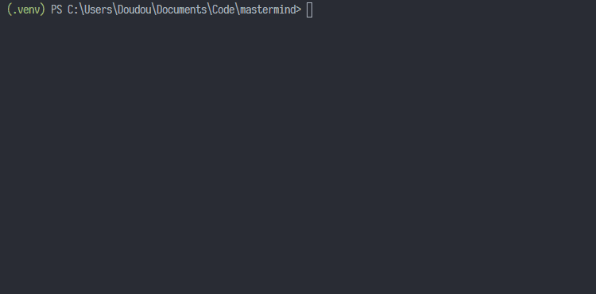

# Mastermind

This repo contains a mastermind solver in python and rust (using rust's [pyo3](https://github.com/PyO3/pyo3) bindings for python).

It always finds the solution in 5 steps or less thanks to [Knuth minimax algorithm](https://en.wikipedia.org/wiki/Mastermind_(board_game)#Five-guess_algorithm)

